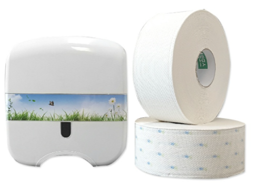
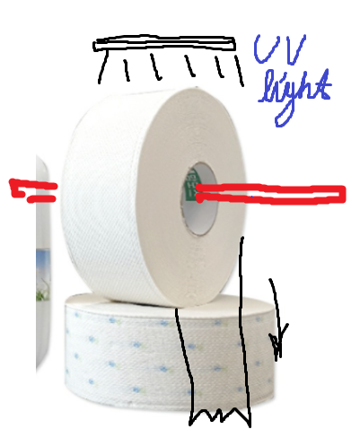
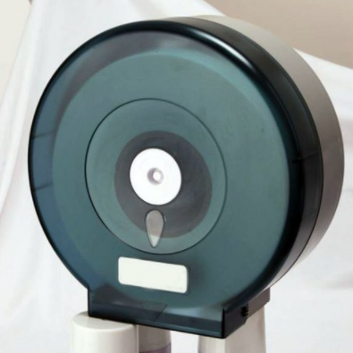
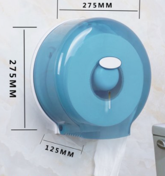

# 1. 주제 선정

# 1. 주제 변경

## 1. 찬민

1. 승강기에 사용 가능한 비접촉 스위치
[승강기에 사용 가능한 비접촉 스위치](https://youtu.be/IY1Oo6NC56E)
2. 스마트 빨래건조대
[https://www.youtube.com/watch?v=-y6r8XLa32M](https://www.youtube.com/watch?v=-y6r8XLa32M)

## 2. 진형

1. **화장실 휴지 남은 양 파악 (★★★)**
    - 판독 방법 및 알고리즘
2. 스포츠 아웃 라인 판독기

## 3. 찬영

1. 스마트폰 거치대 조도/거리/높이 측정

## 4. 성준

1. 점자방식 스마트미러 & 시계

## 5. 동우

1. 스포츠 아웃 라인 판독기
2. 정수기 옆 물컵 자동 배출

# 2. 개발 목적, 필요성, 개요 그리고 로드맵 설정

### **주제: 화장실 휴지 남은 양 파악**

### A. 개발목적 및 필요성

### B. 구현방법

### C. 프로젝트 로드맵

### D. 예상 태클 대처방법

- 큰 휴지 vs 작은 휴지 (범용성 문제)
- 시각적으로 급한 사람들에게 정보를 빠르게 제공할 수 있다는 점 어필요소 (기존 것과 차별점)
    - 휴지를 쌓아두고 교체하는 기존 방식보다 나은 점?
        - 미관상 좋지 않음.
        - 공간 활용 면에서도 좋지 않음. (가방이나 옷 올려두기도 하기 때문)
        - 위생상 좋지 않음.
    - 영화관 같은 곳에서 시각적으로 보여주는 것도 있는데 그것보다 나은 점?

        

        

    - 

# 3. R&R (팀원 역할) 선정

- 다음 주에 하자.
