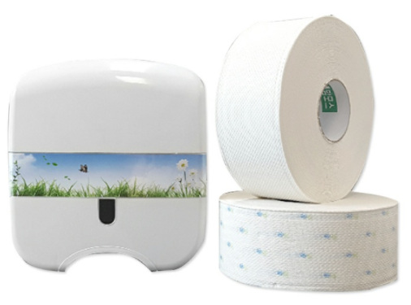

# 프로젝트 디자인 회의

## 주제 1. 사용하는 디바이스 및 소자 및 예상 사용 시나리오 결정

[Arduino Nano 33 IoT with headers](https://www.devicemart.co.kr/goods/view?no=12229354)

1. `Arduino Nano 33 IoT` 모델과 `리튬전지` 그리고 `IR(적외선) transmitter`를을 **화장지 케이스 바깥쪽 아래**에 부착한다. `IR(적외선) receiver`는 반대편 일직선에 부착.
    - 이때 `IR sender and receiver`는 3개 또는 4개를 array로 배치.
    - 소자 크기가 커서 부착이 어려울 시 PCB에 실장하는 방식을 사용.
    `TSOP38xxx receiver chip` & `TSMP58000 transmitter chip` 등 사용

        [Building an Infrared Transmitter and Receiver Board](https://learn.adafruit.com/building-an-infrared-transmitter-and-receiver-board?view=all)

2. `IR Receiver`의 상태에 따라 현재 화장지의 잔량을 3단계 또는 4단계로 나타낸다.
해당 정보는 다음과 같은 두 곳으로 송출된다.
    1. 화장실 칸 문 밖에 설치된 `Arduino Nano의 bluetooth module`
    2. 정보 송출 용 웹서버
3. 화장실 칸 문 밖에 설치된 `Arduino Nano`는 다음과 같은 방법으로 정보를 안내한다.
    1. `RGB module`로 색상을 바꾼다.
    2. `Servo motor`를 제어해서 미리 설치된 `종이`를 움직인다.
4. 두 메인 디바이스 간의 통신은 다음과 같은 방법으로 이뤄진다.
    1. 적정 길이의 점퍼 케이블을 유선으로 연결.
    2. `HC-06`또는 `HM-10` 모듈과 bluetooth로 연결.
5. 화장지 케이스에 설치된 디바이스는 `Timer counter`로 일정 주기마다 다음과 같은 기능을 수행한다.

    ※ 주기 이외에는 `LPM(Low Power Mode)`로 동작해 최소 전력소모를 꾀함.

    1. `IR sensors`의 **송·수신 동작**
    2. 웹서버에 현재 **리튬전지의 남은 베터리 양 정보** 전송
    3. 웹서버에 현재 **화장지의 잔량 정보** 전송
    4. 바깥 디바이스에 **화장지의 현재 상태 정보** 전송

## 주제 2. 외주 업체 후보 선정

여러 곳을 탐색했으나 괜찮은 곳을 찾지 못함.
세부적으로 조금 더 탐색할 필요가 필요.

[재능넷 - 재능마켓, 재능기부](https://www.jaenung.net/?mid=view&no=21040)

## 주제 3. 기타

### 전력소모량 계산

- 사용해야 하는 예상 리튬전지
    - 건전지 용량
    - 건전지 크기
- 아두이노 및 소자의 전력소모량
    - IDLE 상태에서 **1.3~2.4mAh**
    - 프로그램 구동 시 **4.0~6.0mAh**

    [Arduino Nano IoT Power Consumption](https://arduino.stackexchange.com/questions/70557/arduino-nano-iot-power-consumption)

- 예상 사용 시간
    - 예를들어 1,200mAh 짜리 리튬전지를 사용할 때,
    **전력소모 관리** 제대로 안해준다면 일주일에 건전지 하나씩 소비
