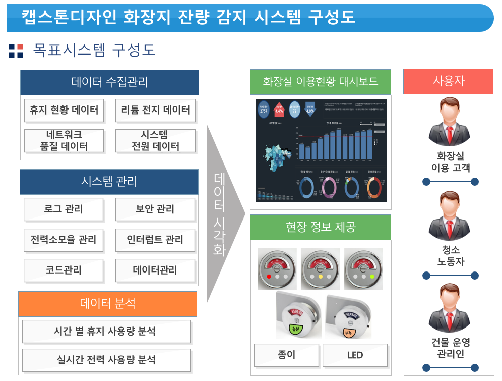
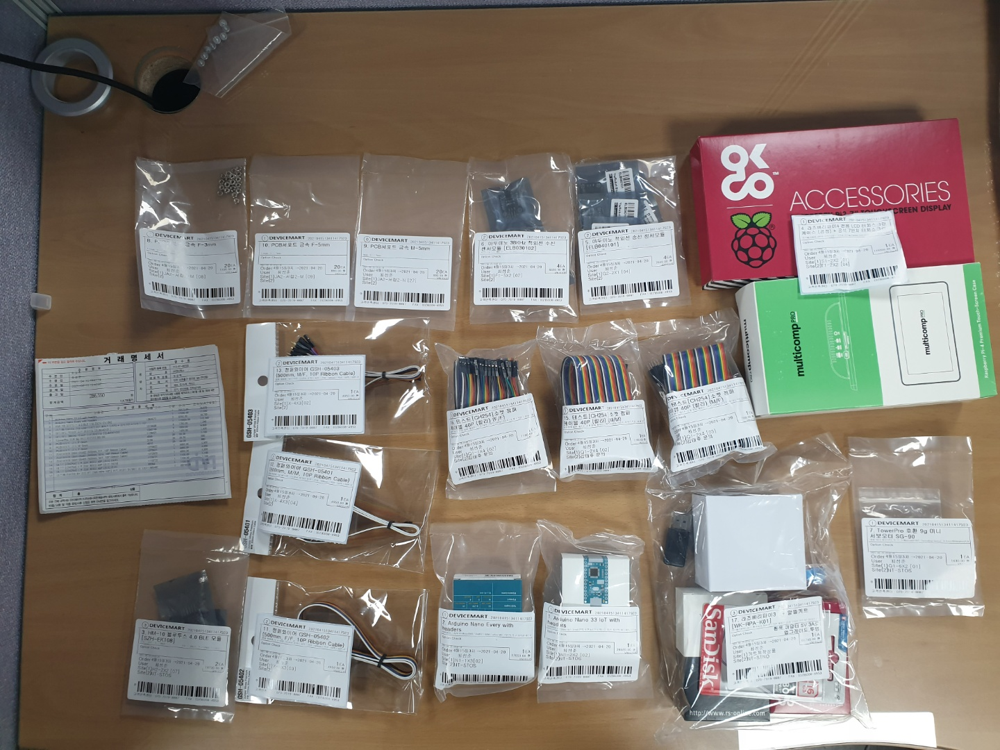
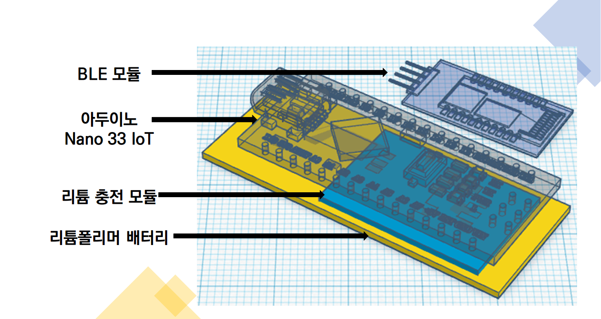
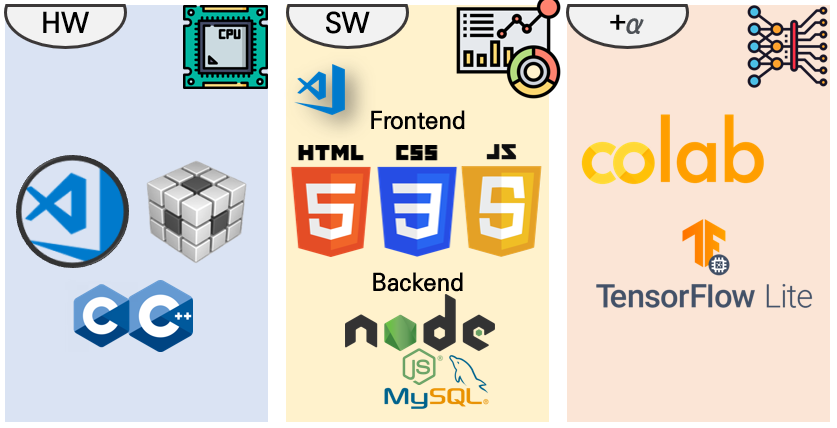
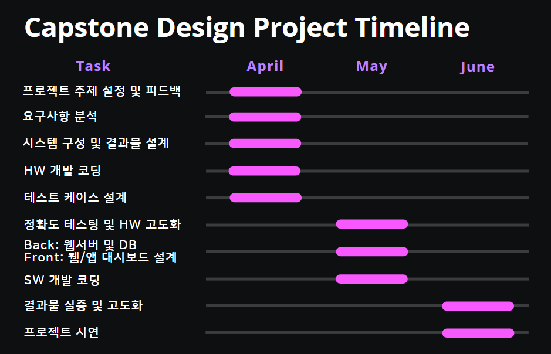
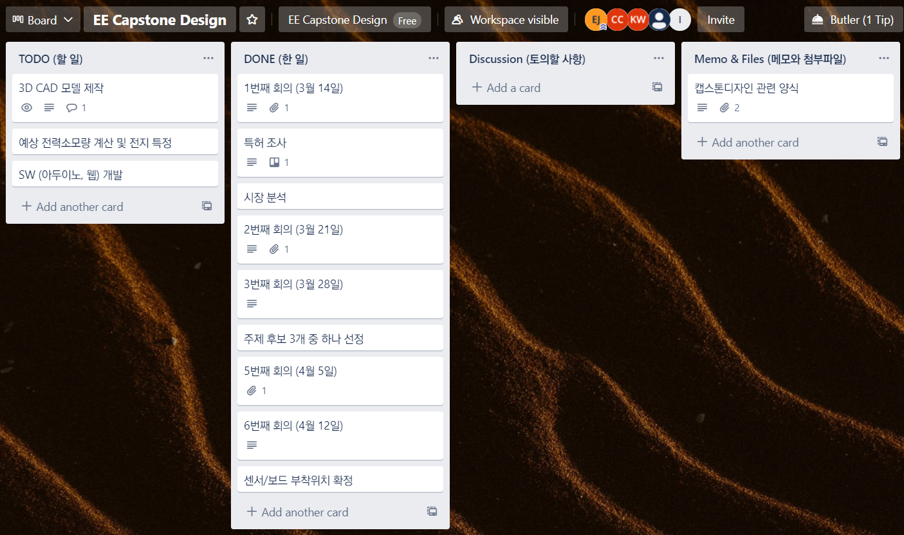

# 캡스톤디자인 6번째 회의록 (4월 15일)

# 1. 프로젝트 시스템 구성도 제작

# 2. 예상 결과물 설계

### 2.1. 프로젝트 준비물 구매 완료

[프로젝트 구성품](https://www.notion.so/0ff9539ef8cc4e14ae47daaa5d8851c6)

### 2.2. 예상 결과물 설계도 구현

**HW**

- **목표: 화장지 잔여량 측정 후 외부에 정보를 표현하는 기능 개발.**
- 타겟보드: Arduino Nano 33 BLE Sense
- IDE: VScode, arduino IDE 2.0 beta, CCS11
- 언어: C/C++

**SW** 

- **목표: 웹서버 구축 및 대시보드를 통한 정보 송출 기능 개발.**
- 타겟보드: 라즈베리파이 3B+
- IDE: VScode
- 언어: 프론트엔드 - HTML/CSS/JS, 백엔드 - NodeJS
- 기타:
    - IoT 프로젝트에서는 RDB(Relation DB) 기반의 MySQL 보다는 Mongo-DB 같은 NoSQL을 이용하지만, 시간 당 트랜잭션의 수가 많은 프로젝트가 아니므로 MySQL을 채택함.

**+α**

- 타겟보드: Arduino Nano 33 BLE Sense
- IDE: VScode
- 언어: 개발 - C/C++, 학습 - Python
- 기타:
    - 시간적인 여력이 허락할 때, 6월 초 '프로젝트 고도화' 단계에서 머신러닝 기능을 도입함.
    - AI 연구에서 화두가 되고 있는 'On-Sensor AI'인 'tinyML'을 'TensorFlow Lite Micro'를 이용해서 구현하고자 함.
    - 단, 아직 머신러닝 도입 목적이 확실히 결정되지 않음.
    (i.e. 시간 별 휴지 사용량 강화학습, 화장지 교환 필요한 시간 예측)

# 3. 조직 R&R 구성

[캡스톤디자인 2021 팀 R&R](https://www.notion.so/26fa961853be4d258fac8b614b681350)

# 4. 프로젝트 타임라인(간트) 구성

# 5. 활발한 협업 도구 사용

